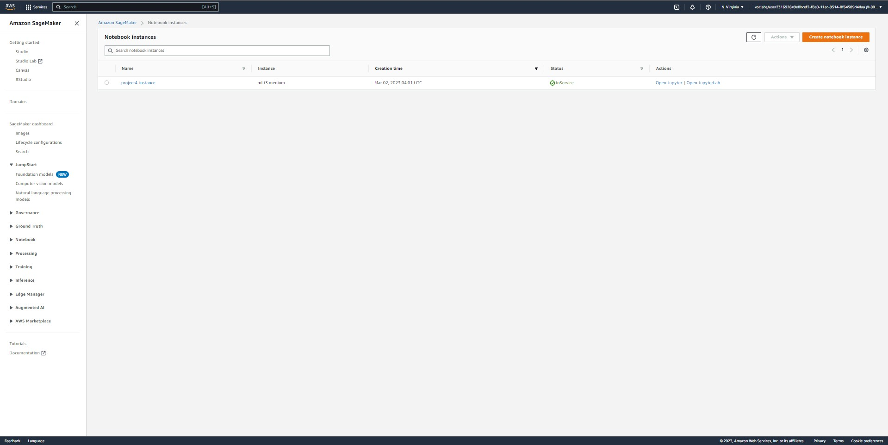
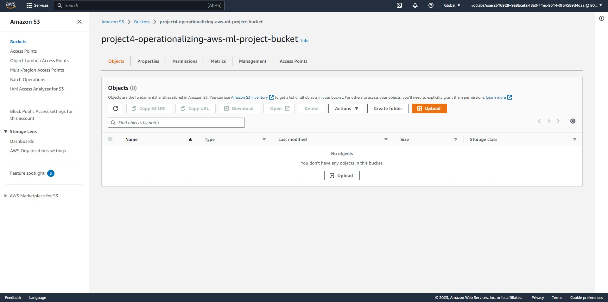
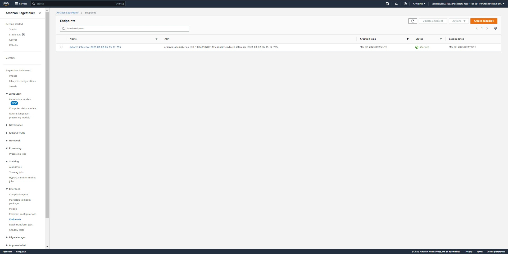
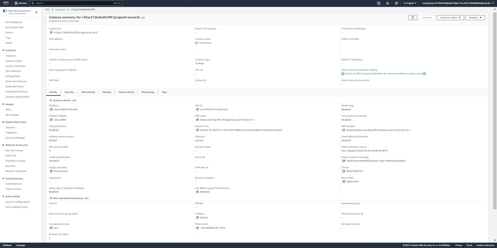
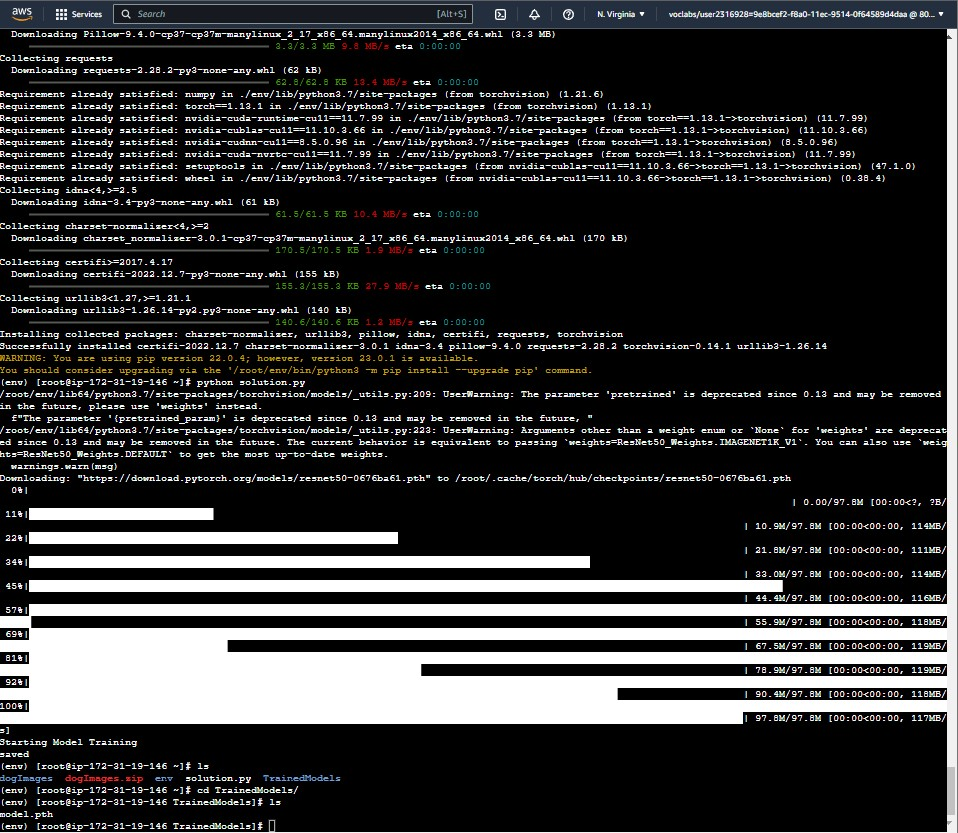
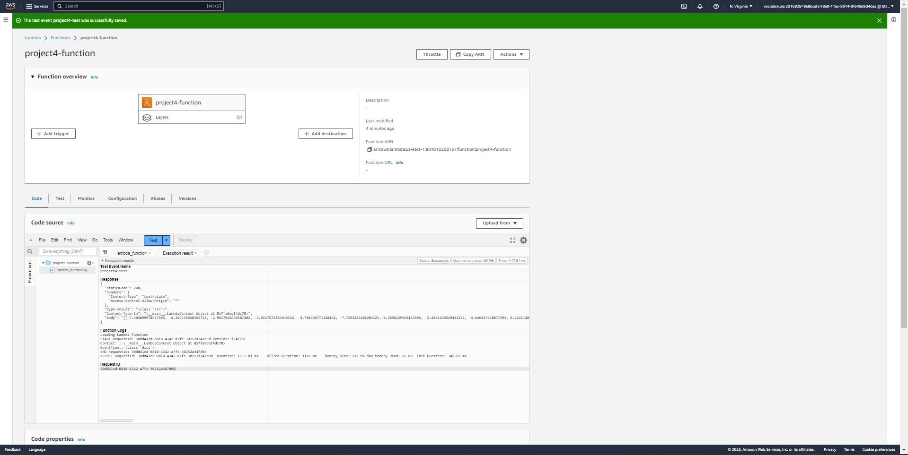
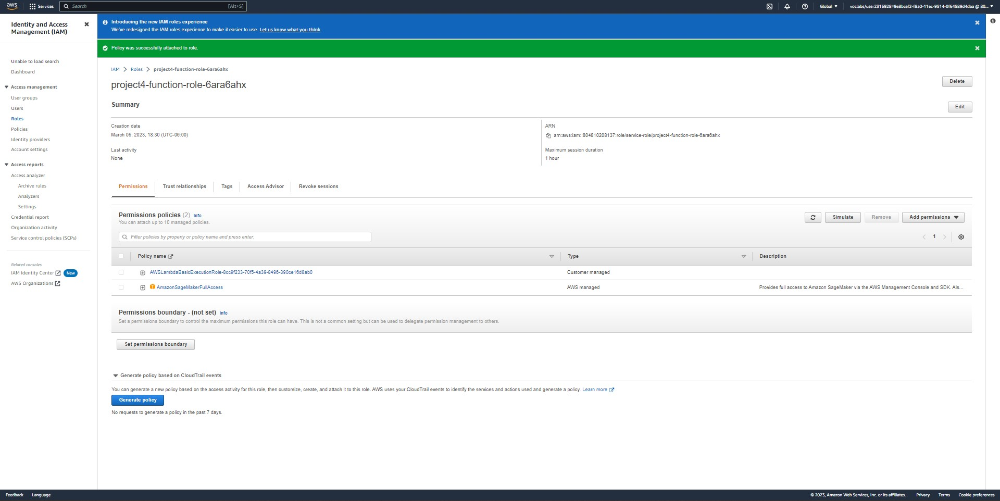
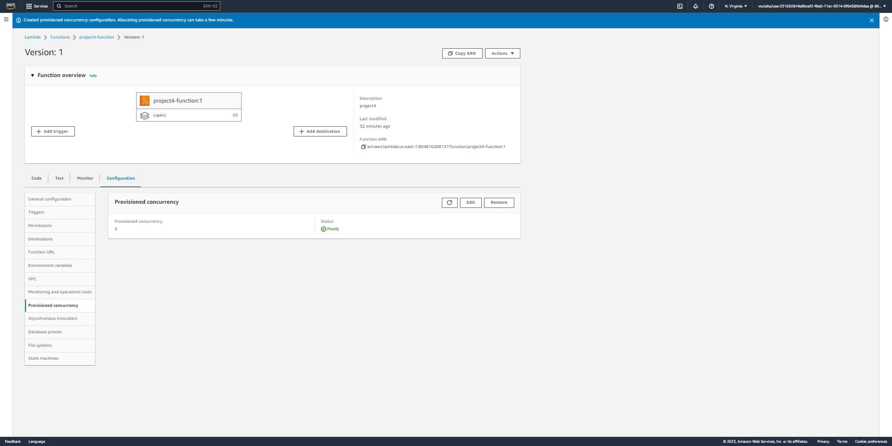
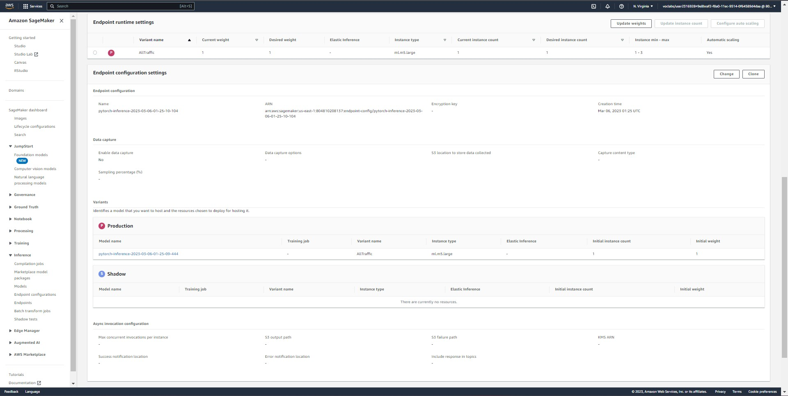

# Report: Operationalizing an AWS ML Project
#### Ashley Perez
### Date: 03/05/2023

### Introduction: This project is an introductory-level image classification model using a pre-trained Resnet deep learning model and pre-labeled images for 133 different dog breeds. The purpose of this project is to extend learnings into configurations for operationalizing ml models in sagemaker.

### Project Set-Up Instructions: Please run notebook in chronological order and include all provided files in same directory. Please find all materials and sources referenced throughout the notebook and script files for more information on way code was written.

## Step 1: Training and deployment on Sagemaker
### Decide which type of Sagemaker instance you should create for your training and deployment. Consider the cost, computing power, and speed of launching for each instance type. Write a short justification of why you chose the instance type you did.
Based on readings from the AWS Sagemaker documentation (here: https://docs.aws.amazon.com/sagemaker/latest/dg/notebooks-available-instance-types.html) I have found a 'most use case' scenario instance known as 'ml.t3.medium'. This is the default instance type for cpu-based sagemaker images and is part of the free tier. The initial thought on approaching instance sizes is to start with a general purpose, smaller instance, and scale to larger ones if required for cost savings and incrementally finding the right-size instance type for the use case using debugging logs and timing of execution.

### Sub-step 1: Deploy Instance in Sagemaker
### Here is an image of the deployed instance in AWS Sagemaker:

### Sub-step 2: Download data to an S3 bucket
### Here is an image of the s3 bucket created for the project:

### Sub-step 3: Deploy end-point for single instance training
### Here is an image of the single instance trained model endpoint:

### Sub-step 4: Deploy end-point for multi instance training
### Here is an image of the multi instance trained model endpoint:

## Step 2: EC2 Training and Deployment
### Decide the type of instance you want, create it in your workspace, and write a justification of why you chose the instance type you did.
 
Following the guidance of students that came before and the session lead for this course, some generic guidelines for starting with an instance type of at least size 'ml.t3.large' and 16 GB of memory, I have decided to go with the lowest possible parameters to save cost and test boundary provided. The threshholds were selected for the EC2 instance type 'ml.t2.large' with 140 GiB of memory for the selected AMI. There was some troubleshooting with installed packages as well, so a virtual environment was set up inside the instance to install packages and run the training script. Further, additional information on choosing the intance types for inference or training was found on this AWS post: https://repost.aws/questions/QULxw59aBCRfmso_f7-VCjRQ/how-to-choose-an-instance-type-for-a-sagemaker-testing-inference.

### Here is an image of the EC2 instance setup used for model training:

### Here is an image of the EC2 model training saved to the EC2 image path 'TrainedModels':

### Write at least one paragraph about the differences between the code in ec2train1.py and the code you used in Step 1.
The code used for the ec2 train model script was similar to the hpo, or hyperparameter optimization, script used for training the model from the sagemaker jupyter environment. Noteable differences between running a training job in sagemaker vs. on an ec2 instance included: the configurations specified in the jypter notebook for sagemaker, the lack of logging functions in ec2 instance training code, hard coding parameters in ec2 training code, and lack of parsing arguments for model parameters in ec2 training code. Further, while the ec2 instance does not require specifications for the training, some of the same parameters and specifications are within the ec2 instance setup configuration, such as the instance type and supported python framework. Overall, it seems like the ec2 instance training code was straightforward and expedited the process of training the model, but trained the model without logging the training job details. On the other hand, training in the sagemaker jypter environment allowed for more exploration and testing of different parameters for configuring specifications. From past experience, it is known that the debugging and logging capability will be valuable in decision-making for configurations for similar models or more mature versions of the model. It seems as if the sagemaker environment is ideal for proof of concept, exploration, configruation testing, and debugging/profiling while ec2 environment is ideal for expediting a training job for cost reasons or when the configurations and testing outcomes are well-known.

## Step 2: Setting up a Lambda Function
### Write at least 1 paragraph describing how this function is written and how it works.
The lambda function used to invoke the endpoint for the trained model in this project includes three main sections. The first is where dependencies are imported and variables are defined. Next, there a lambda handler function where the invoke_enpoint function is used to invoke the endpoint by endpoint name and specifies input and output. Last, the return dictionary contains the results one would expect the lambda to output for successful run, including a 200 status code and outputs from the lambda handler. The endpoint name is hard-coded in this case and teh endpoint name variable value was replaced with the name of the endpoint launched from the sagemaker jypter environment.

### Here is an image of the result of the lambda function tested:

## Step 3: Security and Testing

### Here is an image of the lambda function IAM set-up:

### Write about whether you think your AWS workspace is secure, and whether you think there are any vulnerabilities.
The AWS workspace has default configurations and setup that is secure as it does not assume that all services have access to all other services within the same account. Granting access and permissions then become intentional within AWS. Further, AWS allows users to creates roles within an account with certain permission configurations specified per role. For this project, a FullAccess role for Sagemaker was applied to the lambda execution role and may not be granular enough if this account was shared. Within a work environment like AWS, it may be important to trace permissions and roles associated per user to enforce governance and ensure that permissions are removed when they are no longer needed.

## Step 4: Concurrency and Auto-scaling

### Here is an image of the lambda function set up with concurrency:

### Here is an image of the model endpoint set up with auto-scaling:

### Write about the choices you made in the setup of concurrency and auto-scaling, and why you made each of those choices.
Concurrency was set up for the lambda function. The option was between reserved and provisioned concurrency. Provisioned concurrency was selected with 2 instances ready for response. Althought this normally be higher costs, the purpose of using concurrency will likely be low latency when the endpoint is integrated into an application and it is assumed that if more instances are needed, with a flexible maximum, more instances may be provisioned to meet demand. Further, typically, there are latency threshholds the lambda may be required to meet, so provisioned concurrency will be ideal when deploying a model to production, but this is assuming that an estimate for required number of instances is known. If required number of instances is still unknown at the point where a model is being deployed to production, reserved concurrency may be used in order to study respone and invoke behaviors in an attempt to save money and perform further analysis of latency requirements.
Auto-scaling was configured for the model endpoint: 1-3 instances available, with a 60 second target response and default 300 second start and cool down. The target response was selected with a minute in mind as the maximum response time desired per invocation. The instance count was made in coordination with the lambda provisioned concurrency with 2 instances, where it is seen that an endpoint that can scale to meet demand for multiple lambdas will be valuable and the minimum may be 2 instances at a time. 

## Summary
Working through the project walk-through allowed me to apply concepts used in operationalizing machine learing on aws sagemaker, including, the jypter notebook environment model training, ec2 model training, lambda function endpoint invocation, and service configurations such as concurrency, auto-scaling, and security. These concepts spanned multiple AWS services, including: Amazon Sagemaker, Lambda, EC2, and S3. At a high level, this exposure has allowed visibility into the configuration and approach considerations available for machine learning engineering. With each options comes benefits and drawbacks and understanding these options allows for better understanding of which tools on AWS are useful in different applications. Having walked through steps of configuring model training and enpoints, approaching questions on how models are configured is more straighforward. It seems, once a model is ready to be operationlized, understanding the context for which it will be deployed will be highly valuable in defining requirements and thershholds (such as minimum and maximums) for model configurations in AWS.